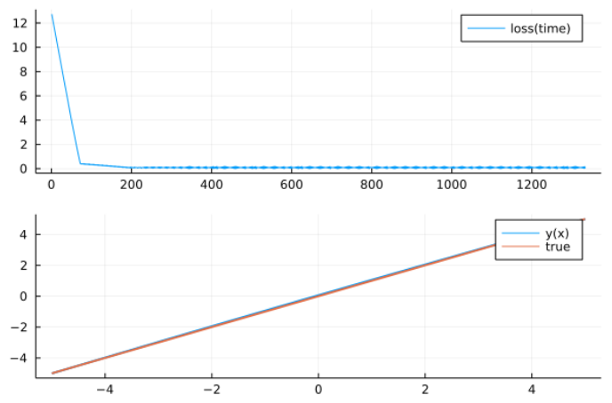
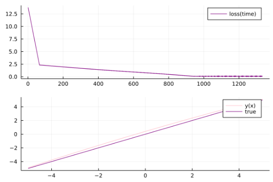

# Solving Basic Variational Calculus Problems Numerically with Gradient Descent
## Abstract and Disclaimer
This repository contains an implementation of a method I have come up with for approximating solutions to certain Euler-Lagrange equations in the Julia Language. I will elaborate on the method and the intuition further in this text, however, as of now, everything I know about mathematics is a result of my self-study and I am not a professional mathematician yet (in fact, when I made this I was barely even an undergraduate) which means that this is not the best numerical method for such tasks. It could also be a duplicate of some other method. It is simply what I thought of right after I heard about the Calculus of Variations. In case you would like to look through something better, see the last section with helpful web pages.
## Problem Setup
The simplest problem of 1-dimensional Variational Calculus is to minimize a functional  which is defined by
1) \
to find an optimal function . In the expression above  and  are points between which we minimize our functional.\
By setting the derivative of  to  and performing some intriguing manipulations, which are beyond our interest for now, we get the Euler-Lagrange Equation that our function  must satisfy:
2) 
## The Method
The basic idea is to turn our Variational Calculus problem into a minimization task which we can solve numerically using simple gradient descent.
We can rewrite our solution function  as:\
3) \
However, in terms of approximating the solution , we will obviously pick a constant  such that:\
4)  and \
The  coefficients are, of course, unknown.\
Now, let us investigate a function\
5) \
which is based upon the equation (2) and measures how different is our approximation  from  at certain . For convenience purposes, we will consider it a function of multiple variables, as technically for us, not only it is dependent on  but also on . Thus, generally:\
6) \
where  is a vector of all  (again, for convenience purposes).\
If we minimize  with respect to  (that is, we will try to find  for which  is minimal over all ) we can, unfortunately, get a function that will not solve our initial problem. Therefore, the actual function we minimize is:\
7) \
where we add two terms to the  so that our function is pinalized for not passing through points  and .
So our initial problem is reduced to\
8) 
the solution of which we can approximate with gradient descent.
## Results
To test the method, let us run it on the simplest possible :\
\
which should give us a simple linear solution ( is a line from  to ). If we plot the true solution against the one found by this method, we get\

## Implementation
I have implemented the method in the Julia Programming Language. The code consists of three parts:
- ELSolution.jl - defines the ELSolution callable wrapper type.
- VarCalcSolver.jl - defines the solveEulerLagrangeGD function.
- Test.jl - uses previous files and plots the solution.
For more details, visit the files directly. All the definitions have been provided with a documentation.
## Helpful links
- [Introduction to Variational Calculus (Video)](https://www.youtube.com/watch?v=VCHFCXgYdvY)
- [The Deep Ritz method: A deep learning-based
numerical algorithm for solving variational problems](https://arxiv.org/pdf/1710.00211.pdf)
- [Basic numerical methods for VarCalc](https://encyclopediaofmath.org/wiki/Variational_calculus,_numerical_methods_of)
